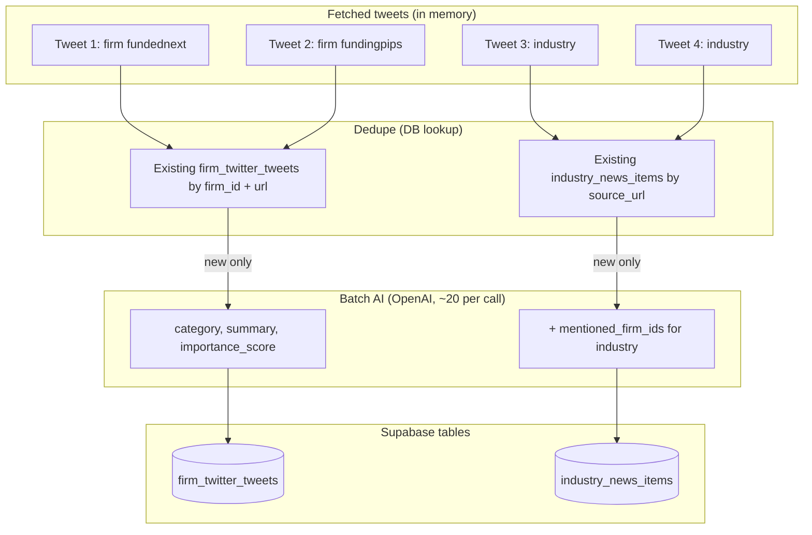
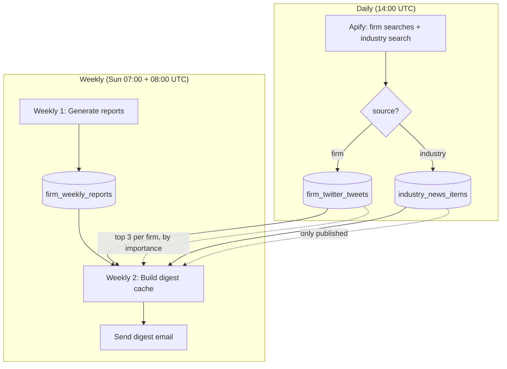

# Twitter daily fetch & weekly reports — full workflow

How **per-firm tweets** and **industry tweets** flow from daily fetch into the weekly digest. All times UTC unless noted.

---

## 1. High-level: daily vs weekly

```
┌─────────────────────────────────────────────────────────────────────────────────┐
│  DAILY (once per day, ~14:00 UTC)                                                │
│  One job: Twitter Fetch + Ingest                                                 │
└─────────────────────────────────────────────────────────────────────────────────┘
        │
        │  Writes to:
        │  • firm_twitter_tweets (per-firm tweets)
        │  • industry_news_items (industry tweets, source_type = 'twitter')
        ▼
┌─────────────────────────────────────────────────────────────────────────────────┐
│  WEEKLY (Sunday 07:00 + 08:00 UTC)                                               │
│  Weekly 1: Generate reports  →  Weekly 2: Send digest email                      │
└─────────────────────────────────────────────────────────────────────────────────┘
        │
        │  Reads from:
        │  • firm_twitter_tweets  →  top 3 tweets per firm (by importance_score)
        │  • industry_news_items  →  only rows where published = true
        ▼
   Subscriber inbox (one email per user, with all their subscribed firms)
```

**Important:** Per-firm tweets go straight into the digest (top 3 per firm). Industry tweets from Twitter are stored as **draft** (`published = false`); they only appear in the digest after an admin publishes them (same as other industry news).

---

## 2. Daily Twitter job: per-firm vs industry

The **single** daily job does both: fetch for **firms** and for **industry**, then ingest into two different tables.


**After fetch**, every tweet is tagged as either:
- **Firm** – has `firmId` (e.g. fundednext, fundingpips), from that firm’s search terms.
- **Industry** – no `firmId`, from `TWITTER_INDUSTRY_SEARCH_TERMS` (e.g. "prop firm news", "Topstep").

Then **ingest** splits by that tag and writes to different tables:



| Destination | Used for | Rows from Twitter |
|-------------|----------|--------------------|
| **firm_twitter_tweets** | Per-firm tweets; digest picks top 3 per firm per week by `importance_score`. | All tweets with `source: 'firm'` (after dedupe). |
| **industry_news_items** | Industry news in digest; only **published** rows are shown. | All tweets with `source: 'industry'` (after dedupe), `source_type = 'twitter'`, `published = false` by default. |

So:
- **Per-firm tweets** → `firm_twitter_tweets` → weekly digest “Top tweets” (no publish step).
- **Industry tweets** → `industry_news_items` → appear in digest only after admin sets `published = true` (e.g. from Content Review).

---

## 3. Weekly reports: where Twitter data appears

Weekly has two steps: **generate reports** (Weekly 1) and **send digest email** (Weekly 2). Twitter data is **read** when building the digest (Weekly 2), not during report generation (Weekly 1).


**What gets into the digest:**

| Source | Table | Condition | In email |
|--------|--------|-----------|----------|
| Firm content (upload, etc.) | firm_content_items | `published = true`, content_date in week | Company news, rule changes, promotions |
| **Per-firm tweets** | **firm_twitter_tweets** | **tweeted_at in week** | **Top 3 per firm by importance_score** (“Top tweets”) |
| Industry news | industry_news_items | `published = true`, content_date in week | Industry section (includes Twitter if published) |

So:
- **Per-firm tweets** from `firm_twitter_tweets` are selected by week and importance; no publish flag.
- **Industry tweets** in `industry_news_items` only show up after an admin publishes them (e.g. in Content Review).

---

## 4. End-to-end flow (daily + weekly)



---

## 5. Summary table

| What | Daily job | Table | Weekly digest |
|------|-----------|--------|----------------|
| **Per-firm tweets** | Fetch (firm terms) → ingest | firm_twitter_tweets | Top 3 per firm (auto, by importance_score) |
| **Industry tweets** | Fetch (industry terms) → ingest | industry_news_items (source_type=twitter, published=false) | Only if admin sets published=true |

**Cron:** One daily workflow runs fetch + ingest together (`scripts/twitter-fetch-job.ts` or GitHub Action `daily-step-twitter-fetch-ingest.yml`). Weekly steps are separate (Weekly 1 → Weekly 2) and already run on Sunday; they read from these tables when building the digest.
