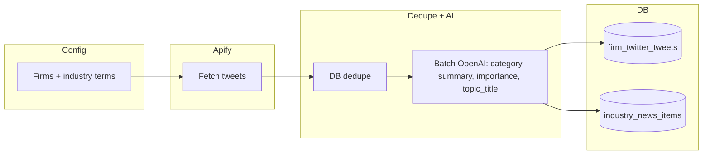
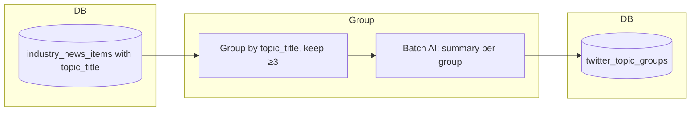
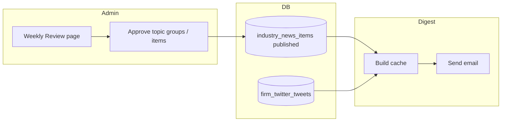

# Twitter/X Monitoring — Operations (S8)

How to operate and tune the **Twitter pipeline**: fetch tweets via Apify → batch AI (category, summary, importance, topic_title) → store in `firm_twitter_tweets` and `industry_news_items`. Industry tweets are grouped by topic for review; the weekly digest shows up to 3 top tweets per firm and published industry news (including topic groups).

**See also:** [Twitter & weekly workflow (diagrams)](./twitter-and-weekly-workflow.md), [Intelligence Feed System Architecture](./intelligence-feed-system-architecture.md), [Content pipeline](./content-pipeline.md), [Daily scraper + weekly incidents & reports](./daily-scraper-weekly-incidents-reports-operations.md).

---

## Overview

1. **Fetch** – Apify runs a Twitter/X scraper (Kaito “Cheapest” Actor) for each monitored firm and once for industry search terms. Tweets are merged and deduped by ID.
2. **Ingest** – New tweets are deduped against the DB, then sent to OpenAI in batches (~20 per call) for category, summary, importance score, and **topic_title** (short headline for grouping). Firm tweets → `firm_twitter_tweets`; industry tweets → `industry_news_items` with `source_type = 'twitter'` (saved as draft).
3. **Topic grouping (weekly)** – A weekly job groups industry tweets with the same topic_title (≥3 per topic) into 1–3 **topic groups** in `twitter_topic_groups`, so admins see topic cards instead of 180+ items.
4. **Review** – Admin uses **Weekly Digest Review** (`/admin/content/weekly-review`): approves topic groups (and/or individual industry items); approving a topic group publishes all tweets in that group.
5. **Digest** – Up to 3 most important tweets per firm (by `importance_score`) plus published industry news (including items from approved topic groups) appear in the weekly digest email.

No manual approval is required for **firm** tweets (they go straight to “top tweets” in the digest). **Industry** tweets only appear after admin publishes them (via topic groups or individual approval).

---

## Step-by-step pipeline (how it works)

End-to-end flow from daily fetch to digest email:

```
┌──────────────────────────────────────────────────────────────────────────────────┐
│  STEP 1 — DAILY (14:00 UTC)                                                        │
│  GitHub Action: "Daily – Twitter Fetch + Ingest"                                   │
└──────────────────────────────────────────────────────────────────────────────────┘
    │
    │  1a. Apify: run scraper per firm + once for industry → raw tweets
    │  1b. Dedupe by tweet ID in memory
    │  1c. Dedupe vs DB: skip existing (firm_id+url) / (source_url)
    │  1d. Batch AI (OpenAI): category, summary, importance_score, topic_title
    │  1e. Insert: firm → firm_twitter_tweets | industry → industry_news_items
    ▼
┌──────────────────────────────────────────────────────────────────────────────────┐
│  STEP 2 — WEEKLY (Sunday 06:00 UTC)                                                │
│  GitHub Action: "Weekly Step 0 – Twitter Topic Groups"                            │
└──────────────────────────────────────────────────────────────────────────────────┘
    │
    │  2a. Read industry_news_items (source_type=twitter) for current week
    │  2b. Group by normalized topic_title; keep groups with ≥3 tweets
    │  2c. Batch AI: one summary per group
    │  2d. Replace twitter_topic_groups rows for that week
    ▼
┌──────────────────────────────────────────────────────────────────────────────────┐
│  STEP 3 — ADMIN REVIEW (any time before send)                                      │
│  Page: /admin/content/weekly-review                                                │
└──────────────────────────────────────────────────────────────────────────────────┘
    │
    │  3a. Admin selects week → sees Industry Topic Groups (1–3 cards) + Industry News
    │  3b. Checks topic groups / items to publish → Clicks "Approve & Publish"
    │  3c. Backend: sets published=true on selected industry_news_items and topic groups
    ▼
┌──────────────────────────────────────────────────────────────────────────────────┐
│  STEP 4 — WEEKLY (Sunday 07:00 + 08:00 UTC)                                        │
│  Weekly Step 1: Generate reports | Weekly Step 2: Send digest                      │
└──────────────────────────────────────────────────────────────────────────────────┘
    │
    │  4a. Digest build reads: firm_twitter_tweets (top 3 per firm), industry_news_items (published)
    │  4b. Email sent to subscribers with firm content + industry news (incl. from topic groups)
    ▼
   Subscriber inbox
```

**Diagram — Daily ingest (Step 1):**



**Diagram — Weekly topic grouping (Step 2):**



**Diagram — Review & digest (Steps 3–4):**



---

## Prerequisites

### APIFY_TOKEN

- **Where to get it:** [Apify Console](https://console.apify.com/account/integrations) → Integrations → API token. Create a token (read + run actors).
- **Where to set it:**
  - **Local / script:** Put `APIFY_TOKEN=...` in `.env` at repo root (do not commit). Scripts load it via `dotenv`.
  - **GitHub Actions:** Repo → Settings → Secrets and variables → Actions → New repository secret → name `APIFY_TOKEN`, value = your token.
- **Actor used:** **Kaito “Cheapest” Tweet Scraper** – `kaitoeasyapi~twitter-x-data-tweet-scraper-pay-per-result-cheapest`. Defined in `lib/apify/twitter-scraper.ts` (`DEFAULT_ACTOR_ID`). Override with `APIFY_TWITTER_ACTOR_ID` in env if you switch to another actor.

### Other env (fetch + ingest)

- **OPENAI_API_KEY** – Batch categorization (same as Trustpilot classifier).
- **NEXT_PUBLIC_SUPABASE_URL**, **SUPABASE_SERVICE_ROLE_KEY** – Writes to `firm_twitter_tweets` and `industry_news_items`.

---

## Config

Firms and search terms are defined in code (no DB table).

| What | File | What to edit |
|------|------|----------------|
| Firms and firm search terms | `config/twitter-monitoring.ts` | `TWITTER_MONITORING_FIRMS` – add/remove `{ firmId, searchTerms }`. |
| Industry search terms | `config/twitter-monitoring.ts` | `TWITTER_INDUSTRY_SEARCH_TERMS` – add/remove strings. |
| Limits (cost/volume) | `config/twitter-monitoring.ts` | `TWITTER_MAX_ITEMS_PER_TERM`, `TWITTER_MAX_ITEMS_PER_FIRM`, `TWITTER_MAX_ITEMS_INDUSTRY`. |

**Adding a new firm:**

1. Ensure the firm exists in `firm_profiles` (or your firms table) with the same `id` you will use.
2. In `config/twitter-monitoring.ts`, add an entry to `TWITTER_MONITORING_FIRMS`:
   ```ts
   {
     firmId: "newfirm",
     searchTerms: [
       "NewFirm",
       "from:NewFirm",
       "NewFirm prop firm",
     ],
   },
   ```
3. Deploy (or run the script locally). The next fetch will include the new firm.

**Adding industry keywords:** Append to `TWITTER_INDUSTRY_SEARCH_TERMS` in the same file.

---

## Usage

### 1. Per run: how many tweets we fetch

Each daily run (or manual `npx tsx scripts/twitter-fetch-job.ts`) fetches tweets in two ways:

| Stream | What runs | Default cap | Env override |
|--------|-----------|-------------|---------------|
| **Per firm** | One Apify run per firm in `TWITTER_MONITORING_FIRMS`. Each run uses that firm’s `searchTerms`; Apify returns up to **max per term** and we cap **total per firm**. | **150 tweets max per firm** (across all its terms). Up to **50 per search term**. | `TWITTER_MAX_ITEMS_PER_FIRM`, `TWITTER_MAX_ITEMS_PER_TERM` |
| **Industry** | One Apify run for all `TWITTER_INDUSTRY_SEARCH_TERMS`. | **100 tweets max total** for the industry run. Up to **50 per search term**. | `TWITTER_MAX_ITEMS_INDUSTRY`, `TWITTER_MAX_ITEMS_PER_TERM` |

- **Example (defaults):** 3 firms × up to 150 = up to 450 firm tweets; 1 industry run = up to 100 industry tweets. After merge and dedupe by tweet ID, total can be lower.
- Set the env vars in `.env` (local) or in the GitHub Action / Vercel env to change these limits.

### 2. How the AI classifier works (batch)

The classifier runs **only on new tweets** (after DB dedupe). It is **batched**, not one call per tweet.

| Aspect | Detail |
|--------|--------|
| **Where** | `lib/ai/categorize-tweets.ts` – `categorizeTweetBatch(tweets, { isIndustry })` |
| **Batch size** | **20 tweets per OpenAI call** (default). Configurable via `TWITTER_AI_BATCH_SIZE` (env); max 25. Same idea as Trustpilot’s batch classify. |
| **Flow** | Ingest splits new tweets into chunks of `TWITTER_AI_BATCH_SIZE`. Each chunk is sent in **one** request; the model returns **one array** of results in the same order (category, summary, importance_score per tweet). |
| **Firm tweets** | One prompt per batch; response: `{ category, summary, importance_score }` per tweet. No `mentioned_firm_ids` (not needed for firm tweets). |
| **Industry tweets** | Same batching; response includes `mentioned_firm_ids` and **topic_title** (short headline for grouping). |
| **topic_title** | Short headline (3–8 words) per tweet; same phrasing for same topic so weekly job can group ≥3 tweets into one topic card. |
| **Model** | `gpt-4o-mini`. Retries with backoff on failure. |

So: e.g. 45 new firm tweets → 3 batch calls (20 + 20 + 5). Fewer API calls and lower cost than one call per tweet.

---

## Running manually

**Single command (fetch + ingest):**

From repo root with `.env` containing `APIFY_TOKEN`, `OPENAI_API_KEY`, and Supabase vars:

```bash
npx tsx scripts/twitter-fetch-job.ts
```

- Logs: fetch counts (total, per firm, industry), then ingest counts (firm/industry inserted and skipped).
- Optional env: `TWITTER_MAX_ITEMS_PER_FIRM`, `TWITTER_MAX_ITEMS_INDUSTRY`, `TWITTER_MAX_ITEMS_PER_TERM`, `TWITTER_AI_BATCH_SIZE` (default 20, max 25). See `.env.example`.

**Verification script (one search term, no ingest):**

```bash
npx tsx scripts/twitter-fetch-verify.ts
```

Uses the first industry term by default; useful to confirm Apify and token work without running the full pipeline.

---

## Cron (GitHub Actions)

| Job | Workflow file | Schedule | What it does |
|-----|----------------|----------|--------------|
| **Daily – Twitter Fetch + Ingest** | `daily-step-twitter-fetch-ingest.yml` | Daily **14:00 UTC** | Apify fetch → dedupe → batch AI → insert firm_twitter_tweets + industry_news_items (with topic_title). |
| **Weekly Step 0 – Twitter Topic Groups** | `weekly-step0-twitter-topic-groups.yml` | Sunday **06:00 UTC** | Groups industry tweets for **current week** by topic_title (≥3 per topic) → writes twitter_topic_groups. Same week semantics as Trustpilot incidents. |

**Manual run (trigger from GA):**

1. GitHub → **Actions** → select the workflow (e.g. “Daily – Twitter Fetch + Ingest” or “Weekly Step 0 – Twitter Topic Groups”).
2. **Run workflow** → choose branch (e.g. `main`) → **Run workflow**.
3. Open the run to see logs (fetch counts, ingest inserted/skipped, or “Created N topic group(s)”).

**Secrets required:** `APIFY_TOKEN` (daily only), `OPENAI_API_KEY`, `NEXT_PUBLIC_SUPABASE_URL`, `SUPABASE_SERVICE_ROLE_KEY`.

---

## Topic grouping (weekly)

- **Script:** `scripts/run-twitter-topic-groups.ts`
- **Default week:** **Current week** (offset 0), same as Trustpilot incidents. We run by end of week (e.g. Sunday 6:00 UTC).
- **Override:** `npx tsx scripts/run-twitter-topic-groups.ts -1` for last week; or set `TWITTER_TOPIC_GROUP_WEEK_OFFSET=0` (default) in env.
- **Logic:** Reads `industry_news_items` (source_type=twitter, content_date in week); groups by normalized `topic_title`; keeps groups with **≥3** tweets; generates one AI summary per group; replaces `twitter_topic_groups` rows for that week.
- **Result:** Admin sees 1–3 “Industry Topic Groups” cards on weekly-review instead of 180+ individual items; approving a group publishes all its tweets.

---

## Verification: GitHub Actions → Admin → Emails

How to verify the full pipeline from GA to inbox.

### 1. Trigger and check GitHub Actions

1. **Daily fetch + ingest:** Actions → “Daily – Twitter Fetch + Ingest” → Run workflow. In the run log you should see e.g. `[Twitter fetch] Done ... Total: N (firm: X, industry: Y)` and `[Twitter ingest] ... Firm: A inserted, B skipped. Industry: C inserted, D skipped.`
2. **Topic grouping:** Actions → “Weekly Step 0 – Twitter Topic Groups” → Run workflow. Log should show `[Topic groups] Running for week YYYY-MM-DD – YYYY-MM-DD (offset 0)...` and `Created N topic group(s).` (N can be 0 if that week has no group with ≥3 same topic_title.)

### 2. Check admin Weekly Review page

1. Open **Weekly Digest Review:** `https://<your-app>/admin/content/weekly-review` (e.g. `https://claude-wall.vercel.app/admin/content/weekly-review`).
2. Select the **current week** (or the week you ran topic grouping for). The page shows:
   - **Industry Topic Groups** – If the weekly topic-group job created groups, you see 1–3 cards with topic title, summary, “N tweets”, and “Tweet #id” links. Check the boxes you want to publish → **Approve & Publish**.
   - **Industry News** – Flat list of all industry items for the week (including Twitter); you can approve individually if not in a topic group.
   - **Firm content** and **Trustpilot Incidents** – As before.
3. After approving, published industry items (and topic groups) are included in the next digest send.

### 3. Check digest email

1. **Weekly send** runs Sunday 8:00 UTC (Actions → “Weekly Step 2 – Send Firm Weekly Reports”, or via cron). Alternatively trigger the send endpoint if you have a manual cron.
2. Subscribers receive one email per user with:
   - **Per-firm:** Top 3 tweets (from `firm_twitter_tweets`), firm content, Trustpilot incidents.
   - **Industry:** Published `industry_news_items` (including those from approved topic groups).
3. Open a test subscriber inbox and confirm the email contains the expected firm sections and industry news.

**Quick checklist:** GA daily run logs → industry rows in DB with topic_title → GA weekly topic groups run → topic groups visible on weekly-review → approve → next digest email contains published industry content.

---

## Troubleshooting

| Symptom | Likely cause | What to do |
|--------|----------------|------------|
| “APIFY_TOKEN is not set” | Token missing in env or GitHub secret | Add to `.env` (local) or repo Actions secrets. |
| Apify run timeout / actor error | Actor down, rate limit, or bad request | Check [Apify Console](https://console.apify.com/) → Runs. Reduce `TWITTER_MAX_ITEMS_*` or retry later. |
| OpenAI rate limit / 429 | Too many batch calls in a short time | Wait and re-run; or lower `TWITTER_AI_BATCH_SIZE` (e.g. 10). |
| No rows inserted | All tweets already in DB (dedupe) | Expected if you re-run soon after a run. Check `firm_twitter_tweets` / `industry_news_items` for recent `source_url` / `url`. |
| Duplicate key / insert error | Unique on (firm_id, url) or source_url | Usually means a race or partial retry; safe to re-run (dedupe skips existing). |
| “Created 0 topic group(s)” | No group has ≥3 tweets with same topic_title in that week | See **Why is twitter_topic_groups empty?** below. |
| Topic groups not on weekly-review | Wrong week or job not run | Ensure you ran “Weekly Step 0 – Twitter Topic Groups” for the **current week** (offset 0). On weekly-review, select the same week (Mon–Sun) that the job used. |

### Why is twitter_topic_groups empty?

The job only inserts rows when **at least one topic has ≥3 industry tweets** in the selected week. Two common cases:

1. **Existing rows have no topic_title** – Rows ingested *before* we added `topic_title` to the AI/ingest have `topic_title = NULL`. The job **excludes** them (`.not("topic_title", "is", null)`). So only tweets ingested *after* the topic_title change count. **Fix:** Run **Daily – Twitter Fetch + Ingest** so new tweets get `topic_title`; then run **Weekly Step 0 – Twitter Topic Groups** again. Existing rows can stay as-is (they still show in the flat “Industry News” list on weekly-review).
2. **No cluster of 3+ same topic** – Even with `topic_title` set, we need **≥3 tweets with the same normalized topic_title** in that week. If every topic has 1 or 2 tweets, we create 0 groups. **Fix:** Wait for more data, or temporarily lower the threshold in code (e.g. `MIN_ITEMS_PER_GROUP = 2` in `lib/digest/twitter-topic-groups.ts`) for testing.

**Verify in Supabase (SQL Editor):**

```sql
-- Current week bounds (Mon–Sun UTC); adjust dates to your week
-- Example for week 2026-02-17 to 2026-02-23:
SELECT
  topic_title,
  COUNT(*) AS cnt
FROM industry_news_items
WHERE source_type = 'twitter'
  AND content_date >= '2026-02-17'
  AND content_date <= '2026-02-23'
  AND topic_title IS NOT NULL
GROUP BY topic_title
ORDER BY cnt DESC;
```

- If this returns no rows → no industry Twitter items in that week have `topic_title` (likely old data). Run the daily fetch to ingest new tweets with topic_title.
- If it returns rows but all `cnt < 3` → topics are spread out; no group meets the ≥3 threshold. Either wait for more data or lower the threshold for testing.
- If some rows have `cnt >= 3` → the job should have created groups; re-run the workflow and check GA logs for errors.

**Where to see logs:**

- **GitHub Actions:** Actions → “Daily – Twitter Fetch + Ingest” → latest run → open the job → “Run Twitter fetch + ingest”. Logs show fetch counts and ingest inserted/skipped; errors (without tokens) appear in the step output.
- **Local:** Script prints to stdout; ensure `.env` is loaded (script uses `dotenv/config`).

**Temporarily disabling:**

- **Cron:** In the workflow file, comment out the `schedule` block (keep `workflow_dispatch` if you want manual runs only), or disable the workflow in GitHub Actions UI.
- No feature flag in app code; disabling is via workflow/schedule only.

---

## Cost

- **Apify:** Pay-per-result pricing; free tier ~$5 credits/month. Each run consumes credits based on number of tweets returned. Tune `TWITTER_MAX_ITEMS_PER_TERM`, `TWITTER_MAX_ITEMS_PER_FIRM`, and `TWITTER_MAX_ITEMS_INDUSTRY` to control volume.
- **OpenAI:** Batch categorization ~20 tweets per API call (gpt-4o-mini). Cost scales with number of new tweets per run. `TWITTER_AI_BATCH_SIZE` (default 20, max 25) controls batch size; fewer batches = fewer calls.

For design and spike context, see the sprint docs in `documents/current_sprint/` (e.g. `s8_scope.md`, `s8_twitter-design-decisions.md`).

---

**Last updated:** 2026-02
