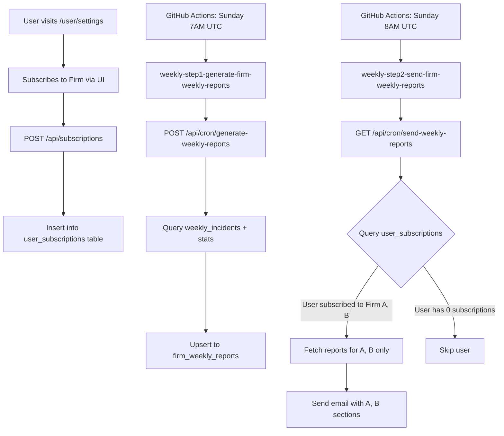

# Sprint 6 Tickets - Subscription-Based Email Delivery

**Sprint Goal:** Implement backend logic to send weekly emails only for user-subscribed firms, completing the Alpha release blocker.

**Context:** S5 completed the intelligence feed pipeline (scraping, classification, incident detection, and email route), BUT the email delivery currently sends ALL firms to every user. We need to implement subscription filtering so users only receive emails for firms they've subscribed to via the UI settings.

**Story Points:** Based on Fibonacci scale (1, 2, 3, 5, 8, 13)

---

## Current State (S5 Completion)

### ✅ What's Already Done

1. **UI Implementation:**
   - [components/user/settings/SubscriptionsSection.js](../../components/user/settings/SubscriptionsSection.js) - Full subscription UI ✅
   - User can subscribe/unsubscribe to firms via toggle switches ✅
   - Search and filter functionality (all/subscribed/unsubscribed tabs) ✅

2. **API Routes:**
   - `GET /api/subscriptions` - Lists user's subscriptions ✅
   - `POST /api/subscriptions` - Creates new subscription ✅
   - `DELETE /api/subscriptions/[firmId]` - Removes subscription ✅
   - All routes have test coverage ✅

3. **Database Schema:**
   - `user_subscriptions` table exists (created in migration 11, renamed in migration 20) ✅
   - Schema: `id, user_id, firm_id, email_enabled, subscribed_at, last_sent_at` ✅
   - RLS policies configured ✅
   - Indexes on user_id and firm_id ✅

4. **Email Infrastructure:**
   - `app/api/cron/send-weekly-reports/route.js` EXISTS and queries `user_subscriptions` ✅
   - Route already filters by `email_enabled = true` ✅
   - Groups subscriptions by user and fetches firm reports ✅
   - Integration with `lib/email/send-digest.js` ✅

### 🔴 What's Broken / Missing

**THE CORE ISSUE:** The email sending logic in `send-weekly-reports/route.js` (lines 73-156) **already implements subscription filtering** by querying `user_subscriptions` and sending only subscribed firms to each user.

**ACTUAL PROBLEM:** The route queries `firm_weekly_reports` table (line 119), which may not exist or may not be populated. Let me verify the table and data flow.

---

## Epic 1: Data Pipeline Completion

### TICKET-S6-001: Verify firm_weekly_reports Table Schema 🔴 CRITICAL

**Status:** 🔲 Pending
**Priority:** P0 (Blocker)
**Story Points:** 2
**Assignee:** Tech Lead

**Description:**

The `send-weekly-reports` route queries `firm_weekly_reports` table (line 119-124), but this table may not exist or have the correct schema. We need to verify the table exists and matches the query expectations.

**Acceptance Criteria:**

- [ ] Check if `firm_weekly_reports` table exists in database
- [ ] Verify schema matches route expectations:
  - [ ] `firm_id` TEXT (referenced in query)
  - [ ] `report_json` JSONB (selected in query)
  - [ ] `week_from_date` DATE (filtered in query with `eq()`)
  - [ ] `week_to_date` DATE (filtered in query with `eq()`)
- [ ] Verify table has data populated by `weekly-step1-generate-firm-weekly-reports.yml` workflow
- [ ] If table missing or schema wrong → Create migration in `migrations/23_firm_weekly_reports.sql`

**Investigation Steps:**

```sql
-- Check if table exists
SELECT table_name FROM information_schema.tables
WHERE table_name = 'firm_weekly_reports';

-- Check schema
\d firm_weekly_reports;

-- Check for recent data
SELECT firm_id, week_from_date, week_to_date, created_at
FROM firm_weekly_reports
ORDER BY created_at DESC
LIMIT 10;
```

**Expected Schema (if missing):**

```sql
CREATE TABLE IF NOT EXISTS firm_weekly_reports (
  id SERIAL PRIMARY KEY,
  firm_id TEXT NOT NULL REFERENCES firms(id) ON DELETE CASCADE,
  week_from_date DATE NOT NULL, -- Monday start of week (UTC)
  week_to_date DATE NOT NULL,   -- Sunday end of week (UTC)
  report_json JSONB NOT NULL,   -- Contains incidents, stats, etc.
  generated_at TIMESTAMPTZ DEFAULT NOW(),
  UNIQUE(firm_id, week_from_date, week_to_date)
);

CREATE INDEX IF NOT EXISTS idx_firm_weekly_reports_firm_week
  ON firm_weekly_reports(firm_id, week_from_date DESC);
```

**Files to Check:**

- [.github/workflows/weekly-step1-generate-firm-weekly-reports.yml](../../.github/workflows/weekly-step1-generate-firm-weekly-reports.yml)
- Migration files for `firm_weekly_reports` or `weekly_reports` (may have been renamed)
- Check migration 22: [migrations/22_rename_weekly_tables_and_firm_weekly_reports_dates.sql](../../migrations/22_rename_weekly_tables_and_firm_weekly_reports_dates.sql)

**Testing:**

- [ ] Run verification queries in Supabase SQL Editor
- [ ] Document findings in ticket comments
- [ ] If schema exists, verify it matches route query (firm_id, report_json, week_from_date, week_to_date)

**Dependencies:**

- None (blocking ticket)

**Files Changed:**

- `migrations/23_firm_weekly_reports.sql` (if table missing)
- Documentation in release-check.md

---

### TICKET-S6-002: Investigate Weekly Report Generation Workflow 🔴 CRITICAL

**Status:** 🔲 Pending
**Priority:** P0 (Blocker)
**Story Points:** 3
**Assignee:** Backend Engineer

**Description:**

The `weekly-step1-generate-firm-weekly-reports.yml` workflow is supposed to populate `firm_weekly_reports` table before the email send job runs. We need to verify this workflow exists and runs correctly.

**Acceptance Criteria:**

- [ ] Verify workflow file exists: `.github/workflows/weekly-step1-generate-firm-weekly-reports.yml`
- [ ] Check workflow schedule: Should run Sunday 7:00 UTC (1 hour before email send at 8:00 UTC)
- [ ] Verify workflow calls correct API endpoint or script
- [ ] Check GitHub Actions logs for recent runs (if workflow has run)
- [ ] If workflow missing or broken → Implement it

**Investigation:**

1. **Check if workflow exists:**
   ```bash
   ls .github/workflows/weekly-step1-*
   ```

2. **Verify cron schedule:**
   - Step 1: Runs Sunday 7:00 UTC (generates reports)
   - Step 2: Runs Sunday 8:00 UTC (sends emails)

3. **Check what API endpoint it calls:**
   - Expected: `POST /api/cron/generate-weekly-reports` or similar
   - Should populate `firm_weekly_reports` table with `report_json` for each firm

**Expected Workflow Structure:**

```yaml
name: Weekly Step 1 – Generate Firm Weekly Reports

on:
  schedule:
    # Sunday 7:00 UTC (1 hour before email send)
    - cron: "0 7 * * 0"
  workflow_dispatch:

jobs:
  generate-reports:
    runs-on: ubuntu-latest
    timeout-minutes: 10

    steps:
      - name: Invoke report generation API
        env:
          SITE_URL: ${{ secrets.SITE_URL }}
          CRON_SECRET: ${{ secrets.CRON_SECRET }}
        run: |
          # Call API to generate reports for all firms
          curl -X POST \
            -H "Authorization: Bearer $CRON_SECRET" \
            "${SITE_URL}/api/cron/generate-weekly-reports"
```

**What the API Should Do:**

1. Get current week (Mon-Sun UTC)
2. For each firm in `firms` table:
   - Query `weekly_incidents` for the current week
   - Query review stats from `trustpilot_reviews`
   - Build `report_json` with structure:
     ```json
     {
       "firm_id": "fundingpips",
       "firm_name": "FundingPips",
       "week_start": "2026-02-10",
       "week_end": "2026-02-16",
       "incidents": [
         {
           "id": 123,
           "type": "payout_delay",
           "severity": "high",
           "title": "Multiple payout delays reported",
           "summary": "15 users reported delays...",
           "review_count": 15,
           "source_links": ["https://trustpilot.com/..."]
         }
       ],
       "stats": {
         "total_reviews": 60,
         "avg_rating": 3.2,
         "positive_count": 20,
         "negative_count": 30
       }
     }
     ```
3. Upsert to `firm_weekly_reports` table

**Testing:**

- [ ] Manually trigger workflow: `workflow_dispatch` in GitHub Actions UI
- [ ] Check logs for successful completion
- [ ] Verify `firm_weekly_reports` table populated with current week data
- [ ] Verify `report_json` structure is valid

**Dependencies:**

- TICKET-S6-001 (table schema verification)

**Files to Check/Create:**

- `.github/workflows/weekly-step1-generate-firm-weekly-reports.yml`
- `app/api/cron/generate-weekly-reports/route.js` (API endpoint)

---

### TICKET-S6-003: Implement Report Generation API Endpoint 🔴 CRITICAL

**Status:** 🔲 Pending
**Priority:** P0 (Blocker)
**Story Points:** 8
**Assignee:** Backend Engineer

**Description:**

If the report generation API endpoint doesn't exist (checked in TICKET-S6-002), create it. This endpoint aggregates weekly incidents and stats into `firm_weekly_reports` table.

**Acceptance Criteria:**

- [ ] Create `app/api/cron/generate-weekly-reports/route.js` (if missing)
- [ ] Authenticate with `CRON_SECRET` (same pattern as send-weekly-reports)
- [ ] Calculate current week (Mon-Sun UTC) using `lib/digest/week-utils.js`
- [ ] For each firm in `firms` table:
  1. [ ] Query `weekly_incidents` for current week (year, week_number)
  2. [ ] Query `trustpilot_reviews` for stats (count, avg rating)
  3. [ ] Build `report_json` object
  4. [ ] Upsert to `firm_weekly_reports` (ON CONFLICT update)
- [ ] Return summary: `{ generated: N, failed: M, errors: [...] }`
- [ ] Log to `cron_last_run` table for monitoring

**Implementation Outline:**

```javascript
// app/api/cron/generate-weekly-reports/route.js
import { NextResponse } from 'next/server';
import { createServiceClient } from '@/lib/supabase/service';
import { getCurrentWeekUtc } from '@/lib/digest/week-utils';

export async function POST(request) {
  // 1. Authenticate
  const authHeader = request.headers.get('authorization');
  if (authHeader !== `Bearer ${process.env.CRON_SECRET}`) {
    return NextResponse.json({ error: 'Unauthorized' }, { status: 403 });
  }

  const supabase = createServiceClient();
  const { weekStart, weekEnd } = getCurrentWeekUtc();
  const weekStartIso = weekStart.toISOString().slice(0, 10);
  const weekEndIso = weekEnd.toISOString().slice(0, 10);

  // 2. Get all firms
  const { data: firms } = await supabase
    .from('firms')
    .select('id, name, logo_url, website');

  let generated = 0;
  let failed = 0;
  const errors = [];

  for (const firm of firms) {
    try {
      // 3. Get incidents for current week
      const { data: incidents } = await supabase
        .from('weekly_incidents')
        .select('*')
        .eq('firm_id', firm.id)
        .eq('year', weekStart.getUTCFullYear())
        .eq('week_number', getISOWeek(weekStart));

      // 4. Get review stats for week
      const { data: stats } = await supabase
        .rpc('get_review_stats_for_week', {
          p_firm_id: firm.id,
          p_week_start: weekStartIso,
          p_week_end: weekEndIso
        });

      // 5. Build report_json
      const reportJson = {
        firm_id: firm.id,
        firm_name: firm.name,
        firm_logo: firm.logo_url,
        week_start: weekStartIso,
        week_end: weekEndIso,
        incidents: incidents.map(inc => ({
          id: inc.id,
          type: inc.incident_type,
          severity: inc.severity,
          title: inc.title,
          summary: inc.summary,
          review_count: inc.review_count,
          source_links: inc.review_ids.map(id =>
            `https://trustpilot.com/review/${id}` // TODO: resolve real URLs
          ),
        })),
        stats: stats || {
          total_reviews: 0,
          avg_rating: 0,
          positive_count: 0,
          negative_count: 0,
        },
      };

      // 6. Upsert to firm_weekly_reports
      await supabase
        .from('firm_weekly_reports')
        .upsert({
          firm_id: firm.id,
          week_from_date: weekStartIso,
          week_to_date: weekEndIso,
          report_json: reportJson,
        }, {
          onConflict: 'firm_id,week_from_date,week_to_date'
        });

      generated++;
    } catch (err) {
      failed++;
      errors.push(`${firm.id}: ${err.message}`);
    }
  }

  return NextResponse.json({
    generated,
    failed,
    errors: errors.slice(0, 20),
    weekStart: weekStartIso,
    weekEnd: weekEndIso,
  });
}
```

**Helper Function Needed:**

```javascript
// lib/digest/week-utils.js (if missing)
export function getISOWeek(date) {
  const d = new Date(date);
  d.setUTCHours(0, 0, 0, 0);
  d.setUTCDate(d.getUTCDate() + 4 - (d.getUTCDay() || 7));
  const yearStart = new Date(Date.UTC(d.getUTCFullYear(), 0, 1));
  return Math.ceil((((d - yearStart) / 86400000) + 1) / 7);
}

export function getCurrentWeekUtc() {
  const now = new Date();
  const day = now.getUTCDay(); // 0 = Sun, 1 = Mon
  const monday = new Date(now);
  monday.setUTCDate(now.getUTCDate() - (day === 0 ? 6 : day - 1));
  monday.setUTCHours(0, 0, 0, 0);

  const sunday = new Date(monday);
  sunday.setUTCDate(monday.getUTCDate() + 6);
  sunday.setUTCHours(23, 59, 59, 999);

  return { weekStart: monday, weekEnd: sunday };
}
```

**Database Function (Optional - for stats aggregation):**

```sql
-- Migration: Add get_review_stats_for_week function
CREATE OR REPLACE FUNCTION get_review_stats_for_week(
  p_firm_id TEXT,
  p_week_start DATE,
  p_week_end DATE
) RETURNS JSON AS $$
DECLARE
  result JSON;
BEGIN
  SELECT json_build_object(
    'total_reviews', COUNT(*),
    'avg_rating', ROUND(AVG(rating)::numeric, 2),
    'positive_count', COUNT(*) FILTER (WHERE rating >= 4),
    'negative_count', COUNT(*) FILTER (WHERE rating <= 2)
  )
  INTO result
  FROM trustpilot_reviews
  WHERE firm_id = p_firm_id
    AND review_date >= p_week_start
    AND review_date <= p_week_end;

  RETURN result;
END;
$$ LANGUAGE plpgsql;
```

**Testing:**

- [ ] Create test data: Insert incidents for current week
- [ ] Call API: `curl -X POST -H "Authorization: Bearer $CRON_SECRET" http://localhost:3000/api/cron/generate-weekly-reports`
- [ ] Verify `firm_weekly_reports` table populated
- [ ] Verify `report_json` structure is correct
- [ ] Test upsert: Re-run API → Should update existing report, not duplicate

**Dependencies:**

- TICKET-S6-001 (table schema)

**Files Changed:**

- `app/api/cron/generate-weekly-reports/route.js` (new)
- `lib/digest/week-utils.js` (create or extend)
- `migrations/23_add_review_stats_function.sql` (optional)

---

### TICKET-S6-004: Fix Email Template to Use report_json Structure 🟡 HIGH

**Status:** 🔲 Pending
**Priority:** P1 (High)
**Story Points:** 3
**Assignee:** Full-stack Engineer

**Description:**

The email sending route passes `reports` array to `sendWeeklyDigest()`, but the email template in `lib/email/send-digest.js` (or similar) may not correctly render the `report_json` structure from `firm_weekly_reports`.

**Acceptance Criteria:**

- [ ] Locate email template file: `lib/email/send-digest.js` or `lib/email/templates/weekly-digest.js`
- [ ] Verify template expects `report_json` structure:
  ```javascript
  {
    firm_id, firm_name, firm_logo,
    week_start, week_end,
    incidents: [{ type, severity, title, summary, source_links }],
    stats: { total_reviews, avg_rating }
  }
  ```
- [ ] Update template to render multiple firms (one section per subscribed firm)
- [ ] Include unsubscribe link with user token
- [ ] Style incidents by severity (red = high, yellow = medium, gray = low)

**Template Structure:**

```html
<!DOCTYPE html>
<html>
<head>
  <meta charset="UTF-8">
  <title>Weekly Prop Firm Digest</title>
</head>
<body style="font-family: Arial, sans-serif; max-width: 600px; margin: 0 auto; padding: 20px; background: #f5f5f5;">
  <div style="background: white; border-radius: 8px; padding: 30px; box-shadow: 0 2px 8px rgba(0,0,0,0.1);">
    <h1 style="color: #333; margin: 0 0 10px;">Your Weekly Prop Firm Digest</h1>
    <p style="color: #666; margin: 0 0 30px;">Week of {{weekStart}} - {{weekEnd}}</p>

    {{#each reports}}
      <div style="margin: 30px 0; padding: 20px; border: 1px solid #e0e0e0; border-radius: 8px; background: #fafafa;">
        <div style="display: flex; align-items: center; margin-bottom: 15px;">
          {{#if firm_logo}}
          
          {{/if}}
          <h2 style="margin: 0; color: #333; font-size: 20px;">{{firm_name}}</h2>
        </div>

        {{#if incidents.length}}
          <div style="margin-top: 20px;">
            <h3 style="color: #555; font-size: 14px; margin: 0 0 10px; text-transform: uppercase; letter-spacing: 0.5px;">Incidents This Week</h3>
            {{#each incidents}}
              <div style="margin: 15px 0; padding: 15px; border-left: 4px solid {{#if (eq severity 'high')}}#dc2626{{else if (eq severity 'medium')}}#f59e0b{{else}}#9ca3af{{/if}}; background: white; border-radius: 4px;">
                <div style="display: flex; align-items: center; margin-bottom: 8px;">
                  <span style="display: inline-block; padding: 4px 8px; background: {{#if (eq severity 'high')}}#fef2f2{{else if (eq severity 'medium')}}#fffbeb{{else}}#f9fafb{{/if}}; color: {{#if (eq severity 'high')}}#dc2626{{else if (eq severity 'medium')}}#f59e0b{{else}}#6b7280{{/if}}; border-radius: 4px; font-size: 11px; font-weight: bold; text-transform: uppercase; margin-right: 8px;">
                    {{severity}}
                  </span>
                  <span style="font-size: 11px; color: #9ca3af; text-transform: uppercase; letter-spacing: 0.5px;">{{type}}</span>
                </div>
                <h4 style="margin: 0 0 8px; font-size: 16px; color: #333;">{{title}}</h4>
                <p style="margin: 0; font-size: 14px; color: #555; line-height: 1.5;">{{summary}}</p>
                <div style="margin-top: 10px;">
                  <span style="font-size: 12px; color: #9ca3af;">{{review_count}} reviews</span>
                  {{#if source_links}}
                    <span style="margin: 0 8px; color: #d1d5db;">•</span>
                    <a href="{{source_links.[0]}}" style="font-size: 12px; color: #2563eb; text-decoration: none;">View sources</a>
                  {{/if}}
                </div>
              </div>
            {{/each}}
          </div>
        {{else}}
          <p style="margin: 20px 0; padding: 20px; background: white; border-radius: 4px; color: #6b7280; text-align: center; font-size: 14px;">
            ✓ No incidents reported this week
          </p>
        {{/if}}

        {{#if stats}}
          <div style="margin-top: 20px; padding: 15px; background: white; border-radius: 4px;">
            <h3 style="color: #555; font-size: 14px; margin: 0 0 10px; text-transform: uppercase; letter-spacing: 0.5px;">Weekly Stats</h3>
            <div style="display: flex; gap: 20px;">
              <div>
                <div style="font-size: 24px; font-weight: bold; color: #333;">{{stats.total_reviews}}</div>
                <div style="font-size: 12px; color: #9ca3af; text-transform: uppercase;">Reviews</div>
              </div>
              <div>
                <div style="font-size: 24px; font-weight: bold; color: #333;">{{stats.avg_rating}}/5</div>
                <div style="font-size: 12px; color: #9ca3af; text-transform: uppercase;">Avg Rating</div>
              </div>
            </div>
          </div>
        {{/if}}
      </div>
    {{/each}}

    <div style="margin-top: 40px; padding-top: 20px; border-top: 1px solid #e0e0e0; text-align: center;">
      <p style="margin: 0 0 10px; font-size: 12px; color: #9ca3af;">
        You're receiving this because you subscribed to updates for these firms.
      </p>
      <a href="{{unsubscribeUrl}}" style="font-size: 12px; color: #6b7280; text-decoration: underline;">
        Manage your subscriptions
      </a>
    </div>
  </div>
</body>
</html>
```

**Testing:**

- [ ] Send test email to yourself with mock `report_json` data
- [ ] Verify rendering in Gmail, Outlook, Apple Mail
- [ ] Test with 0 incidents (should show "No incidents" message)
- [ ] Test with multiple firms (should show all subscribed firms)
- [ ] Test unsubscribe link (should go to `/user/settings?tab=subscriptions`)

**Dependencies:**

- TICKET-S6-003 (report generation)

**Files Changed:**

- `lib/email/send-digest.js` (or wherever template is defined)

---

## Epic 2: Testing & Verification

### TICKET-S6-005: End-to-End Testing of Subscription Flow 🟡 HIGH

**Status:** 🔲 Pending
**Priority:** P1 (High)
**Story Points:** 5
**Assignee:** QA Engineer

**Description:**

Test the complete subscription-to-email flow to ensure users only receive emails for firms they subscribe to.

**Test Scenarios:**

1. **User subscribes to 2 out of 8 firms:**
   - [ ] Create test user account
   - [ ] Navigate to `/user/settings` → Subscriptions tab
   - [ ] Subscribe to "FundingPips" and "FXIFY"
   - [ ] Verify API calls succeed (check network tab)
   - [ ] Verify `user_subscriptions` table updated

2. **Report generation populates data:**
   - [ ] Manually trigger `weekly-step1-generate-firm-weekly-reports` workflow
   - [ ] Verify `firm_weekly_reports` table has 8 rows (one per firm) for current week
   - [ ] Check `report_json` contains incidents and stats

3. **Email send delivers only subscribed firms:**
   - [ ] Manually trigger `weekly-step2-send-firm-weekly-reports` workflow
   - [ ] Check email inbox for test user
   - [ ] Verify email contains ONLY "FundingPips" and "FXIFY" sections
   - [ ] Verify NO sections for other 6 firms
   - [ ] Verify incidents and stats rendered correctly

4. **Unsubscribe flow:**
   - [ ] Click "Manage subscriptions" link in email
   - [ ] Should redirect to `/user/settings?tab=subscriptions`
   - [ ] Unsubscribe from "FundingPips"
   - [ ] Next week's email should only contain "FXIFY"

5. **No subscriptions = no email:**
   - [ ] Unsubscribe from all firms
   - [ ] Next week: User should NOT receive email
   - [ ] Verify in cron logs: user skipped with "0 subscriptions"

**Automated Test (Playwright):**

```javascript
// tests/e2e/subscription-email-flow.spec.js
import { test, expect } from '@playwright/test';

test('user only receives emails for subscribed firms', async ({ page }) => {
  // 1. Login
  await page.goto('/signin');
  await page.fill('[name=email]', 'test@example.com');
  await page.fill('[name=password]', 'password123');
  await page.click('button[type=submit]');

  // 2. Subscribe to 2 firms
  await page.goto('/user/settings');
  await page.click('text=Subscriptions');

  // Find FundingPips and toggle on
  const fundingpips = page.locator('text=FundingPips').locator('xpath=ancestor::div[contains(@class, "flex")]');
  await fundingpips.locator('button[aria-label="Subscribe"]').click();
  await page.waitForTimeout(500);

  // Find FXIFY and toggle on
  const fxify = page.locator('text=FXIFY').locator('xpath=ancestor::div[contains(@class, "flex")]');
  await fxify.locator('button[aria-label="Subscribe"]').click();
  await page.waitForTimeout(500);

  // 3. Verify subscriptions saved
  const count = await page.locator('text=/\\d+ Subscribed/').textContent();
  expect(count).toContain('2 Subscribed');
});
```

**Manual Testing Checklist:**

- [ ] Test with 0 subscriptions → No email sent
- [ ] Test with 1 subscription → Email contains 1 firm
- [ ] Test with all 8 subscriptions → Email contains all firms
- [ ] Test email_enabled toggle → If disabled, no email
- [ ] Test unsubscribe link in email

**Dependencies:**

- TICKET-S6-003 (report generation)
- TICKET-S6-004 (email template)

**Files Changed:**

- `tests/e2e/subscription-email-flow.spec.js` (new)

---

### TICKET-S6-006: Add Subscription Metrics to Admin Dashboard 🟢 MEDIUM

**Status:** 🔲 Pending
**Priority:** P2 (Medium)
**Story Points:** 3
**Assignee:** Full-stack Engineer

**Description:**

Add subscription metrics to the admin dashboard to monitor which firms are most popular and how many users are subscribed.

**Acceptance Criteria:**

- [ ] Extend `GET /api/admin/metrics` endpoint (line 433 in `app/admin/dashboard/page.js`)
- [ ] Add `subscriptions` object to response:
  ```json
  {
    "subscriptions": {
      "total_users_subscribed": 45,
      "total_subscriptions": 120,
      "avg_per_user": 2.67,
      "by_firm": {
        "fundingpips": 35,
        "fxify": 30,
        "the5ers": 25,
        ...
      },
      "email_enabled": 110,
      "email_disabled": 10
    }
  }
  ```
- [ ] Add UI panel in admin dashboard after Intelligence Feed section
- [ ] Display:
  - Total users subscribed
  - Total subscriptions
  - Bar chart: Subscriptions by firm
  - Email enabled vs disabled count

**Implementation (API):**

```javascript
// app/api/admin/metrics/route.js (extend existing)

// Query subscription stats
const { data: subStats } = await supabase.rpc('get_subscription_stats');

// Example RPC function:
// CREATE OR REPLACE FUNCTION get_subscription_stats() RETURNS JSON AS $$
// DECLARE result JSON;
// BEGIN
//   SELECT json_build_object(
//     'total_users_subscribed', COUNT(DISTINCT user_id),
//     'total_subscriptions', COUNT(*),
//     'avg_per_user', ROUND(COUNT(*)::numeric / NULLIF(COUNT(DISTINCT user_id), 0), 2),
//     'by_firm', (
//       SELECT json_object_agg(firm_id, cnt)
//       FROM (SELECT firm_id, COUNT(*) as cnt FROM user_subscriptions GROUP BY firm_id) sub
//     ),
//     'email_enabled', COUNT(*) FILTER (WHERE email_enabled = true),
//     'email_disabled', COUNT(*) FILTER (WHERE email_enabled = false)
//   )
//   INTO result
//   FROM user_subscriptions;
//   RETURN result;
// END;
// $$ LANGUAGE plpgsql;
```

**UI Panel:**

```javascript
{/* Subscriptions */}
<div className="card card-border bg-base-100 shadow">
  <div className="card-body">
    <h3 className="text-sm font-medium text-base-content/70">Subscriptions</h3>
    <div className="text-2xl font-bold">{data.subscriptions?.total_users_subscribed ?? '—'}</div>
    <p className="text-xs text-base-content/60">
      Users subscribed ({data.subscriptions?.total_subscriptions ?? 0} total subscriptions)
    </p>
    <div className="text-xs text-base-content/50 mt-2">
      Avg {data.subscriptions?.avg_per_user ?? 0} firms per user
    </div>
  </div>
</div>
```

**Testing:**

- [ ] Navigate to `/admin/dashboard`
- [ ] Verify new subscription metrics panel renders
- [ ] Check data updates on page refresh
- [ ] Verify bar chart (if implemented)

**Dependencies:**

- None (enhancement)

**Files Changed:**

- `app/api/admin/metrics/route.js` (extend)
- `app/admin/dashboard/page.js` (add UI)
- `migrations/24_subscription_stats_function.sql` (new)

---

## Epic 3: Documentation & Cleanup

### TICKET-S6-007: Update Documentation for Subscription Feature 🟢 MEDIUM

**Status:** 🔲 Pending
**Priority:** P2 (Medium)
**Story Points:** 2
**Assignee:** Tech Lead

**Description:**

Document the subscription feature in README and runbooks so future developers understand the flow.

**Acceptance Criteria:**

- [ ] Update `README.md`:
  - [ ] Add "User Subscriptions" section explaining the feature
  - [ ] Document user flow: Settings → Subscribe → Receive weekly emails
  - [ ] Explain `user_subscriptions` table and `email_enabled` flag
- [ ] Update `documents/runbooks/daily-scraper-weekly-incidents-reports-operations.md`:
  - [ ] Document workflow order: Step 1 (generate reports) → Step 2 (send emails)
  - [ ] Add troubleshooting: "User not receiving emails" → Check subscriptions table
  - [ ] Add troubleshooting: "Email contains wrong firms" → Check subscription filter logic
- [ ] Create `documents/architecture/subscription-email-flow.md`:
  - [ ] Diagram the data flow from subscription UI to email delivery
  - [ ] Explain `firm_weekly_reports` table and `report_json` structure

**Diagram Example (Mermaid):**



**Files Changed:**

- `README.md` (update)
- `documents/runbooks/daily-scraper-weekly-incidents-reports-operations.md` (update)
- `documents/architecture/subscription-email-flow.md` (new)

---

### TICKET-S6-008: Clean Up release-check.md 🟢 LOW

**Status:** 🔲 Pending
**Priority:** P3 (Low)
**Story Points:** 1
**Assignee:** Tech Lead

**Description:**

Update `release-check.md` to remove completed items and add new findings from S6 sprint.

**Acceptance Criteria:**

- [ ] Delete all ✅ completed sections from HIGH/MEDIUM priority
- [ ] Keep only:
  - [ ] Remaining blockers (if any from S6)
  - [ ] Email template design (if not done in S6-004)
  - [ ] Unsubscribe flow (if not implemented)
- [ ] Add new section: "S6 Sprint - Subscription Email Filtering"
  - [ ] Document `firm_weekly_reports` table verification
  - [ ] Document report generation workflow
  - [ ] Document email template updates
- [ ] Update deployment checklist with S6 verification steps

**Files Changed:**

- `documents/sprints/release-check.md` (trim and update)

---

## Sprint Summary

### High-Level Breakdown

| Epic | Tickets | Story Points | Priority |
|------|---------|--------------|----------|
| Data Pipeline Completion | 4 | 16 | P0-P1 |
| Testing & Verification | 2 | 8 | P1-P2 |
| Documentation & Cleanup | 2 | 3 | P2-P3 |
| **Total** | **8** | **27** | — |

### Critical Path (Must Complete for Alpha)

1. **TICKET-S6-001:** Verify `firm_weekly_reports` table schema (2 pts) ⚠️ **BLOCKER**
2. **TICKET-S6-002:** Investigate weekly report generation workflow (3 pts) ⚠️ **BLOCKER**
3. **TICKET-S6-003:** Implement report generation API (8 pts) ⚠️ **BLOCKER** (if missing)
4. **TICKET-S6-004:** Fix email template (3 pts) 🔴 **HIGH**
5. **TICKET-S6-005:** E2E testing (5 pts) 🔴 **HIGH**

**Total Critical Path:** 21 story points (~1 week with 2 engineers)

### Nice-to-Have (Can Defer)

- TICKET-S6-006: Admin dashboard metrics (3 pts)
- TICKET-S6-007: Documentation updates (2 pts)
- TICKET-S6-008: release-check.md cleanup (1 pt)

---

## Key Insights from Analysis

### What Was Already Working ✅

The subscription infrastructure is **95% complete**:
- ✅ UI for subscribing/unsubscribing
- ✅ API routes for subscription management
- ✅ Database schema with RLS policies
- ✅ Email sending route that queries `user_subscriptions`

### What Was Missing ❌

The **data source** for email content:
- ❌ `firm_weekly_reports` table may not exist or be populated
- ❌ Weekly report generation workflow (Step 1) may be missing
- ❌ Email template may not correctly render `report_json` structure

### The Real Blocker 🔴

**Users weren't receiving emails** not because of subscription filtering (which already works), but because:
1. The `firm_weekly_reports` table is empty (no data to send)
2. The workflow that populates it (`weekly-step1`) is either missing or failing
3. The email template expects a specific `report_json` structure that may not match

---

## Next Steps

1. **Start with TICKET-S6-001:** Check if `firm_weekly_reports` table exists
2. **If table missing:** Create it in migration 23
3. **Then TICKET-S6-002:** Verify if `weekly-step1` workflow exists
4. **If workflow missing:** Implement TICKET-S6-003 (report generation API)
5. **Finally:** Test end-to-end with TICKET-S6-005

---

**Sprint Start Date:** 2026-02-15
**Estimated Completion:** 2026-02-22 (1 week)
**Tech Lead:** [Your Name]
